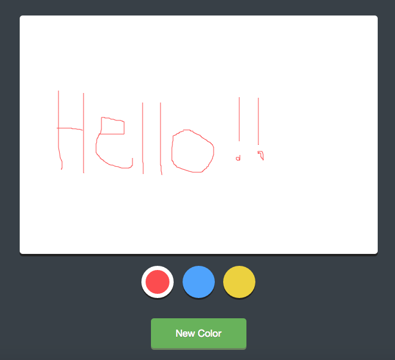

Paint!!
===============================

Try it out [HERE](https://arcane-peak-48808.herokuapp.com/)
----

Browser paint application using HTML Canvas and JavaScript. Choose from existing colours or mix your own.



Design not done by me, code written by me!

Technologies Used:
------
- HTML
- jQuery
- JavaScript
- HTML Canvas
- HTML
- CSS

How to use:
----------

Clone the repository:
```shell
$ git clone https://github.com/alexfakhri/paint_application_in_JS.git
```

Change into the directory:
```shell
$ cd paint_application_in_JS
```

Open in browser:
```shell
$ open index.html
```
